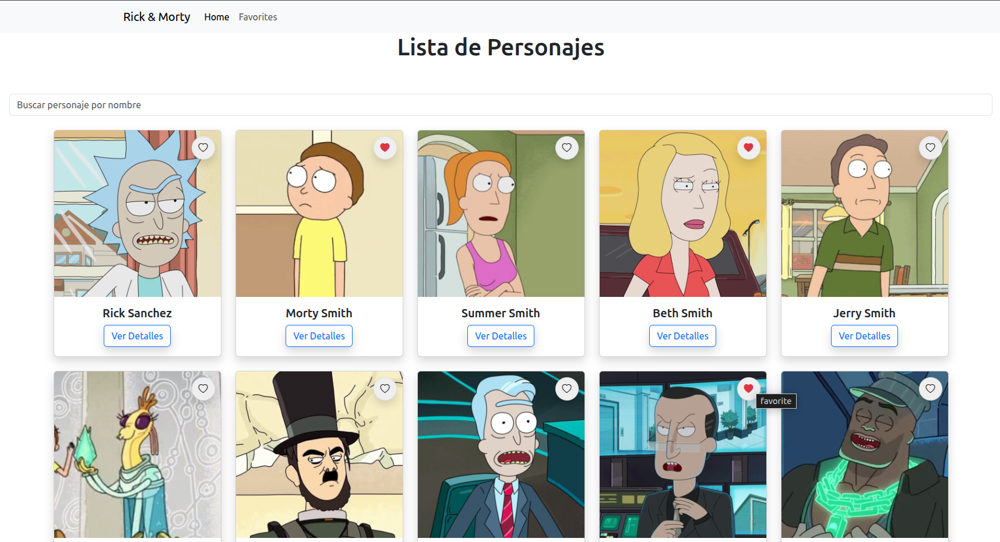
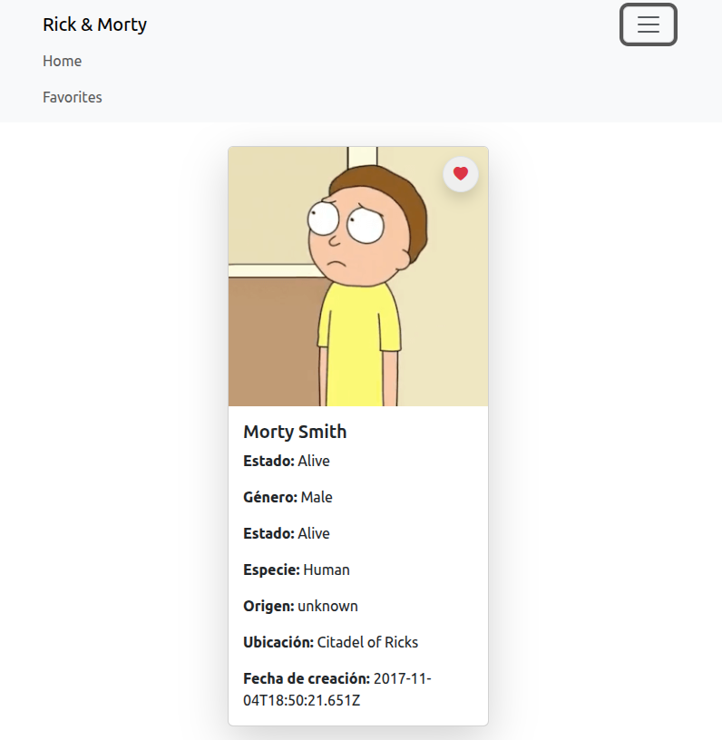
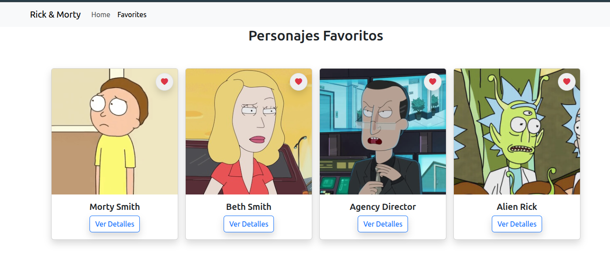
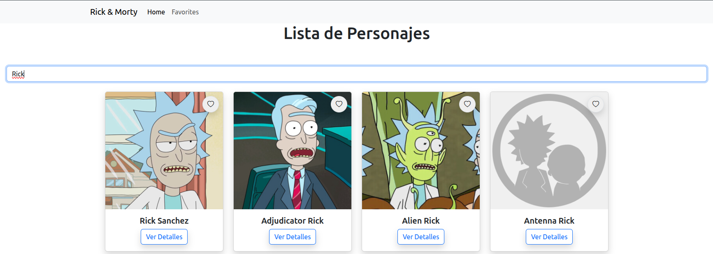

# Rick and Morty Characters Viewer 🛸

Este es un proyecto desarrollado con **React** que permite explorar personajes de la serie **Rick and Morty** utilizando la [Rick and Morty API](https://rickandmortyapi.com/). La aplicación permite ver información básica y detallada de cada personaje, así como marcarlos como favoritos.

## 🔍 Características

- Página principal con una galería de personajes en formato de **cards**.
- Cada card muestra:
  - Imagen del personaje.
  - Nombre.
  - Botones para:
    - Ver más información (detalle).
    - Agregar o quitar de favoritos.
- Página de detalles:
  - Muestra una única card con toda la información del personaje.
- Página de favoritos:
  - Visualiza todos los personajes marcados como favoritos.
- Buscador de personajes:
  - Permite filtrar personajes específicos por su nombre.
- Navegación entre rutas usando `react-router-dom`.
- Estilos modernos utilizando **React-Bootstrap**.
- Diseño responsivo.

## 🧰 Tecnologías usadas

- [React](https://reactjs.org/)
- [React Router DOM v7](https://reactrouter.com/en/main)
- [React-Bootstrap](https://react-bootstrap.github.io/)
- [Rick and Morty API](https://rickandmortyapi.com/)

## 📸 Capturas de pantalla

### Página principal

### Detalle del personaje

### Favoritos

### Búsqueda

